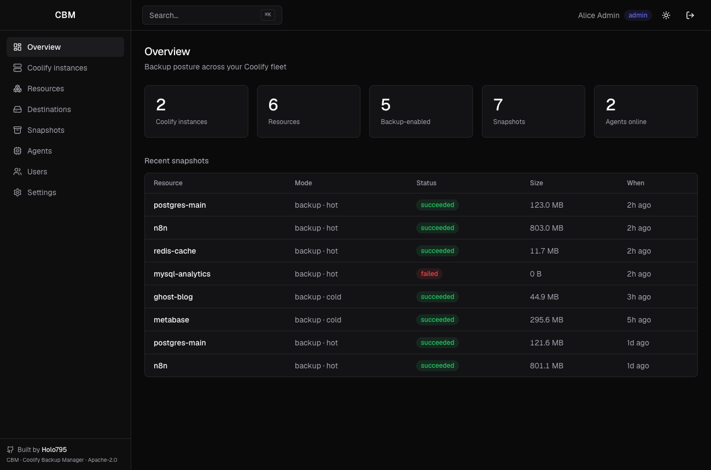
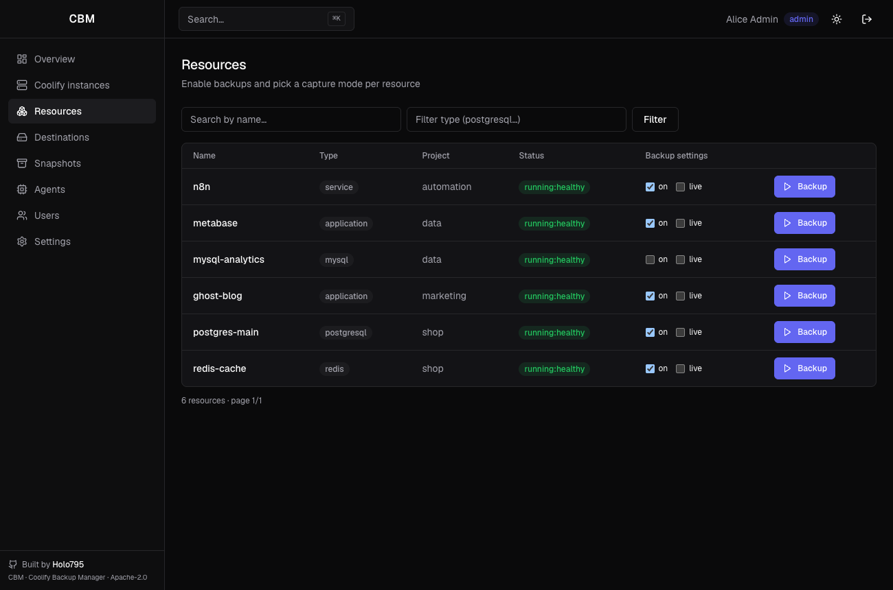
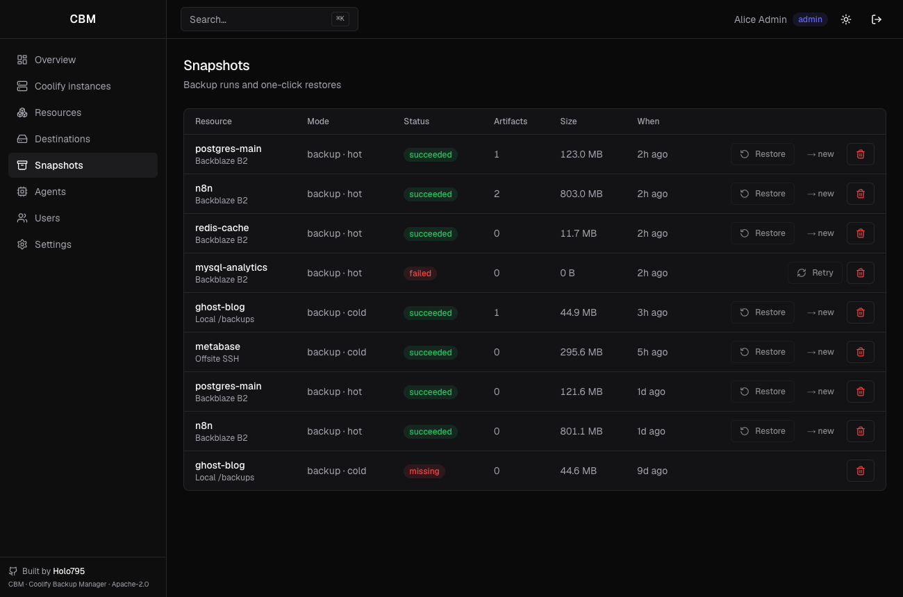
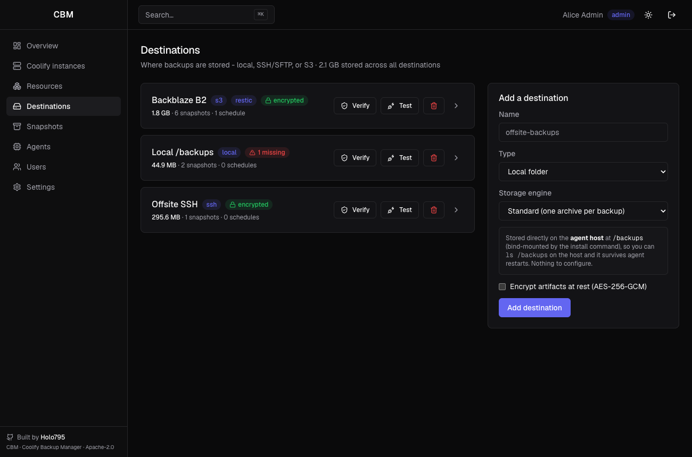
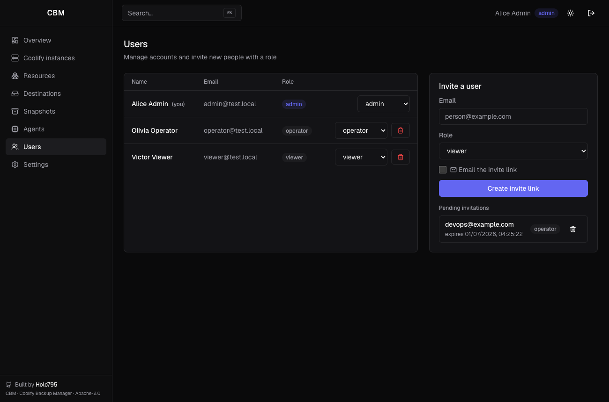
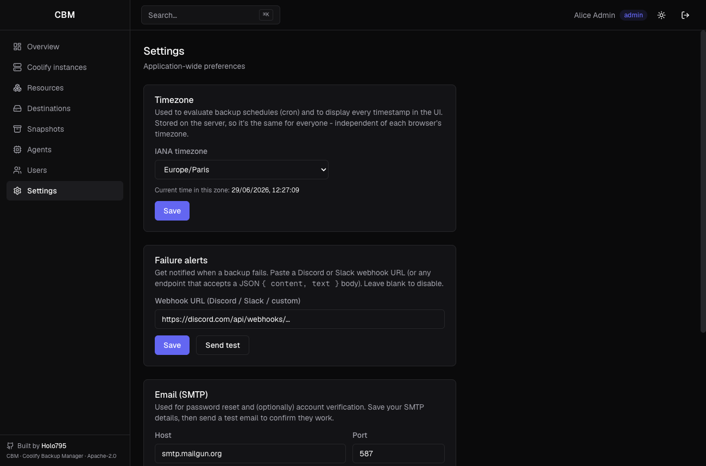
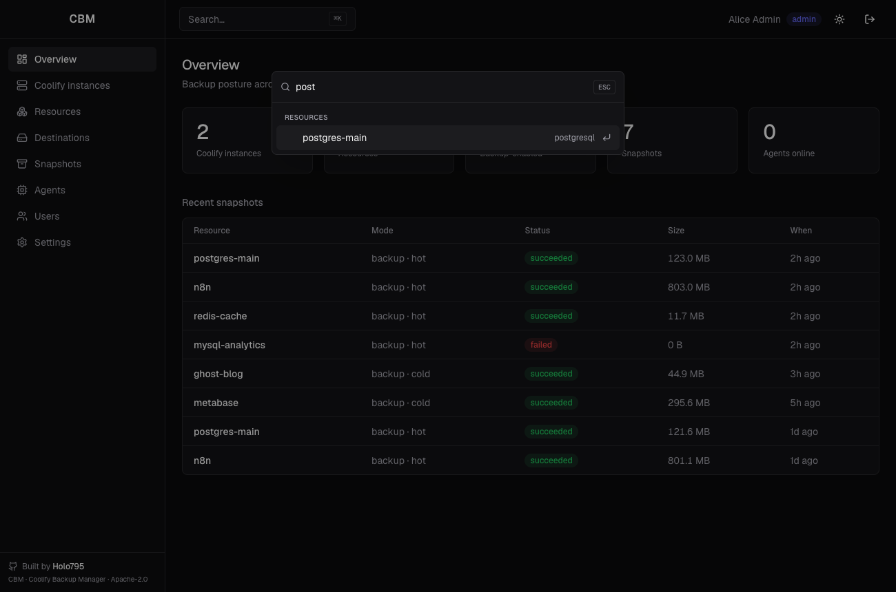
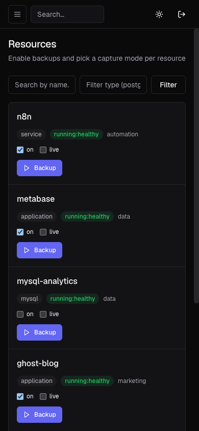

# CBM — Coolify Backup Manager

**Back up and restore _everything_ in [Coolify](https://coolify.io) — not just databases.**
Apps, docker‑compose services, named volumes, host bind mounts and databases, across
multiple Coolify instances and servers, **without ever restarting your running services**.

[](./LICENSE)
[](https://github.com/Holo795/CBMCoolifyBackup/releases)
[](https://github.com/Holo795/CBMCoolifyBackup/actions/workflows/images.yml)

CBM is a self‑hosted control panel + lightweight agents. It gives you consistent, scheduled
backups with multiple destinations (local / SSH‑SFTP / S3), **incremental & deduplicated
storage via [restic](https://restic.net)**, one‑click restore (in place or as a brand‑new
resource), and alerts when something fails, goes missing, or never ran.

> ⚠️ **Backups are only as good as their restores.** Always test that you can actually
> restore a snapshot before relying on it. See [Known limitations](#known-limitations).

---

## Screenshots

| Overview | Resources | Snapshots & restore |
| --- | --- | --- |
|  |  |  |

| Destinations (restic) | Users & roles | Settings (email · alerts) |
| --- | --- | --- |
|  |  |  |

| Command palette | Mobile |
| --- | --- |
|  |  |

---

## Why CBM? (vs Coolify's built‑in backups)

Coolify ships **scheduled database backups** — and that's it. Everything else your stack
needs to actually come back to life isn't covered. CBM backs up the whole resource.

| | Coolify built‑in backups | **CBM** |
| --- | :---: | :---: |
| Scheduled **database** dumps (Postgres/MySQL/MariaDB/Mongo) | ✅ | ✅ |
| **Redis / KeyDB / Dragonfly** | ❌ | ✅ (live RDB) |
| **Application** data (named volumes) | ❌ | ✅ |
| **Docker‑compose services** (every volume + each internal DB) | ❌ | ✅ |
| **Host bind mounts** (data in host folders) | ❌ | ✅ |
| Capture **env vars** so a snapshot restores standalone | ❌ | ✅ |
| **No restart** of the running resource during backup | n/a | ✅ |
| **Incremental + deduplicated + encrypted** storage (restic) | ❌ | ✅ |
| Restore **to a new resource** (clone, re‑pin commit/image) | ❌ | ✅ |
| **Multiple destinations** (local / SSH‑SFTP / S3, jump host) | partial | ✅ |
| **Multi‑server** Coolify instances | n/a | ✅ |
| Alerts on **failed / missing / overdue** backups | ❌ | ✅ |
| **Reconciliation** (detect backups deleted at the destination) | ❌ | ✅ |

---

## Features

- **No restart, ever.** Standalone databases are exported live (`pg_dump`/`mysqldump`/
  `mongodump`); Redis‑family stores via a live RDB export. For volumes, the agent briefly
  *freezes* (`docker pause`) only the containers writing to a volume, copies it, and resumes
  them — the container keeps its state and uptime, never stopped or recreated.
- **Logical exports, even inside services.** A database living *inside* a compose service
  (e.g. the Postgres in n8n) also gets its own logical dump on top of the volume copy —
  application‑consistent and restorable across engine versions.
- **Incremental & deduplicated (restic).** Per destination (local, S3, or SSH/SFTP — including
  a jump host), pick the **restic** engine: only changed data is uploaded, the repository is
  encrypted, retention is delegated to restic, and restore works both in place and to a new
  resource.
- **Restore → new.** Recreate any resource type as a brand‑new Coolify resource (the original
  is never touched): databases, git apps (commit re‑pinned), docker‑image apps (exact
  tag/digest), and compose services (volumes re‑mapped to the clone).
- **Multiple destinations** — local folder, SSH/SFTP (with optional **jump host / bastion**),
  or S3 — with optional AES‑256‑GCM encryption at rest (the restic engine encrypts natively).
- **Multi‑server instances.** A Coolify panel can manage several servers; install one agent
  per server and each backup is routed to the agent on the resource's server automatically,
  with a schedule per server.
- **Alerts** via a generic webhook (Discord / Slack / custom) on **failed**, **missing**
  (deleted at the destination), and **overdue** (never ran) backups.
- **Reconciliation, parallelism & hooks** — a periodic check confirms every backup is still
  present at its destination; agents run several jobs at once (`AGENT_CONCURRENCY`); and you
  can set **per‑container pre/post‑backup commands** (e.g. quiesce an app, flush a cache).
- **Scheduling** with grandfather‑father‑son retention, in a **configurable timezone**.
- **Team access with roles.** Invite people as **admin / operator / viewer** via one‑time
  invitation links (copy‑paste or emailed). Operators run backups/restores; only admins
  configure instances, destinations, schedules, and settings — enforced server‑side, with the
  UI hiding what a role can't use.
- **Email (SMTP).** Optional self‑service **password reset** and **account verification**;
  configured from Settings (or env), with a built‑in test that verifies the connection.

---

## Architecture

```
Controller (web panel + API + scheduler + metadata DB)
     ▲ pull (outbound HTTPS)        │ reads resources via the Coolify API (×N instances)
   Agents (one per Docker host) ── talk to the local Docker socket
     │ push artifacts
   Destinations: local folder · SSH/SFTP (+ jump host) · S3   ·  tar or restic engine
```

- **Controller** — Next.js + Prisma + Better Auth + an in‑process scheduler. Holds metadata,
  encrypts secrets at rest, dispatches jobs. One per deployment.
- **Agent** — Node + the Docker CLI + restic. Pulls jobs (outbound only — nothing to open on
  hosts), runs dumps / volume archives, captures Git & image provenance, transfers to
  destinations. **One per Docker host.**

---

## Install (production)

CBM runs from published images: **`ghcr.io/holo795/cbm-controller`** and
**`ghcr.io/holo795/cbm-agent`**.

### 1. Run the controller

**Option A — Docker Compose (anywhere):**

```bash
curl -fsSLO https://raw.githubusercontent.com/Holo795/CBMCoolifyBackup/main/docker-compose.yml
curl -fsSLO https://raw.githubusercontent.com/Holo795/CBMCoolifyBackup/main/packages/controller/.env.example
mv .env.example .env
# Edit .env: set BETTER_AUTH_URL, a long BETTER_AUTH_SECRET, and a base64 MASTER_KEY:
#   node -e "console.log(require('crypto').randomBytes(32).toString('base64'))"
docker compose up -d
```

**Option B — on Coolify itself:** add this repo as an application (Dockerfile
`Dockerfile.controller`) or a docker‑compose resource, attach a Postgres, and set the same
env vars. The controller runs database migrations automatically on start.

Minimum env: `DATABASE_URL`, `BETTER_AUTH_SECRET`, `BETTER_AUTH_URL`, `MASTER_KEY`. Full
reference in **[docs/configuration.md](docs/configuration.md)**.

> **Keep your `MASTER_KEY` safe.** It encrypts every stored secret (and, with restic, your
> backups). Lose it and encrypted data is unrecoverable.

### 2. First run — create the admin

Open your `BETTER_AUTH_URL` and **register**. The **first account becomes the administrator**,
then public sign‑up closes automatically — no seeding, no default password. To add teammates,
invite them from **Users** with a role (admin / operator / viewer); see
**[docs/accounts.md](docs/accounts.md)**. For password reset and verification emails, configure
SMTP in **Settings → Email** (**[docs/email.md](docs/email.md)**).

### 3. Connect Coolify & install agents

In the UI: **Coolify instances → Connect** (base URL + an API token). Then **Reveal install
command** on the instance card and run the one‑liner **on each Docker host** you want to back
up:

```bash
curl -fsSL https://your-controller/install.sh | CBM_TOKEN=cbm_… sh
```

It starts the agent container with the Docker socket mounted and a persistent `/backups`
volume. The agent auto‑detects which Coolify server it serves. Re‑running the command
reconfigures in place.

Full walkthrough: **[docs/installation.md](docs/installation.md)**.

---

## Quick start (development)

```bash
npm install
docker compose -f docker-compose.dev.yml up -d                 # controller Postgres on :5544
cp packages/controller/.env.example packages/controller/.env   # edit secrets
npm run db:push --workspace @cbm/controller
npm run dev --workspace @cbm/controller                        # http://localhost:3000
npm run lint && npm run typecheck && npm test                  # the CI checks, repo‑wide
```

The dev compose also starts **[Mailpit](https://mailpit.axllent.org)** (a catch‑all SMTP
inbox on `:8025`) so you can test the email flows locally — see [docs/email.md](docs/email.md).

---

## Documentation

Detailed docs live in **[`/docs`](docs/)**:

- [Installation](docs/installation.md) — controller, agents, on Coolify
- [Configuration](docs/configuration.md) — every environment variable
- [Accounts & roles](docs/accounts.md) — users, roles, invitation links
- [Email (SMTP)](docs/email.md) — password reset, verification, dev mailer
- [Destinations](docs/destinations.md) — local · SSH/SFTP · jump host · S3 · tar vs restic
- [Backups](docs/backups.md) — how each resource type is captured, hooks, live mode
- [Restore](docs/restore.md) — in place vs → new
- [Multi‑server](docs/multi-server.md), [Alerts](docs/alerts.md),
  [Reconciliation & retention](docs/reconciliation-retention.md)
- [Security](docs/security.md) · [Troubleshooting / FAQ](docs/troubleshooting.md)

---

## Known limitations

Being upfront so you don't lose data by surprise.

- **No automatic restore verification** — artifacts are checksummed and destinations are
  reconciled, but backups are not (yet) test‑restored. Test your restores.
- **Volume copies are crash‑consistent** (the app recovers), not application‑consistent; an
  in‑service database restored from its *volume* is version‑locked to the same engine version
  — use the logical dump captured alongside it for a portable restore.
- **Local destinations are per agent** — their files live on each agent's host, so
  reconciliation/retention/restore for a local destination run on the producing agent; if that
  host is down, those operations wait for it. Use SSH/S3 for a single shared location.
- An in‑place **restore of volumes** briefly stops the resource (database‑dump restores don't).

---

## Security

- Secrets (Coolify tokens, SSH/S3 creds, encryption & restic keys) are **AES‑256‑GCM
  encrypted at rest** with `MASTER_KEY` (falls back to `BETTER_AUTH_SECRET`).
- Agents authenticate with a bearer token (sha256‑hashed in the DB); enrollment tokens are
  one‑time and shown once.
- **Role‑based access** (admin / operator / viewer) is enforced on every mutating action
  server‑side; invitation links are single‑use, expiring, and stored only as a sha256 hash.
- The Docker socket grants root‑equivalent access — agents run trusted on each host.

More in [docs/security.md](docs/security.md).

---

## Contributing

Issues and PRs welcome — see **[CONTRIBUTING.md](CONTRIBUTING.md)**. Documentation lives in
[`/docs`](docs/); please update it alongside code changes.

## License

Apache License 2.0 — Copyright © 2026 [Holo795](https://github.com/Holo795).
See [`LICENSE`](./LICENSE) and [`NOTICE`](./NOTICE).
